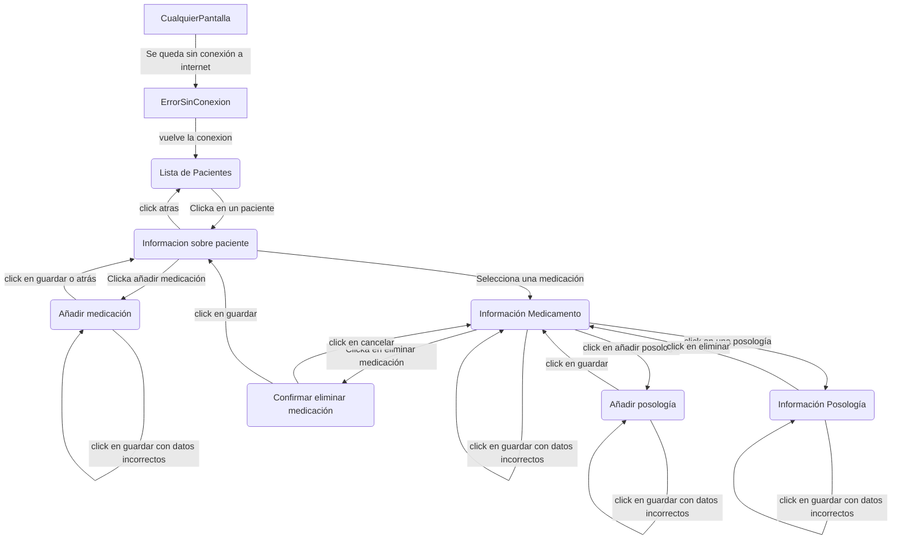
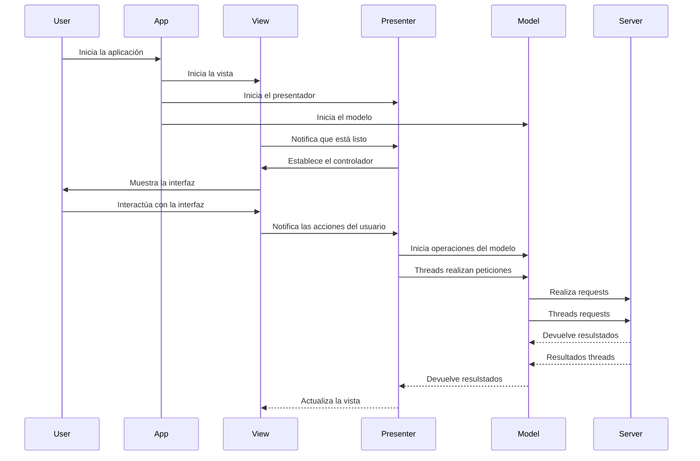
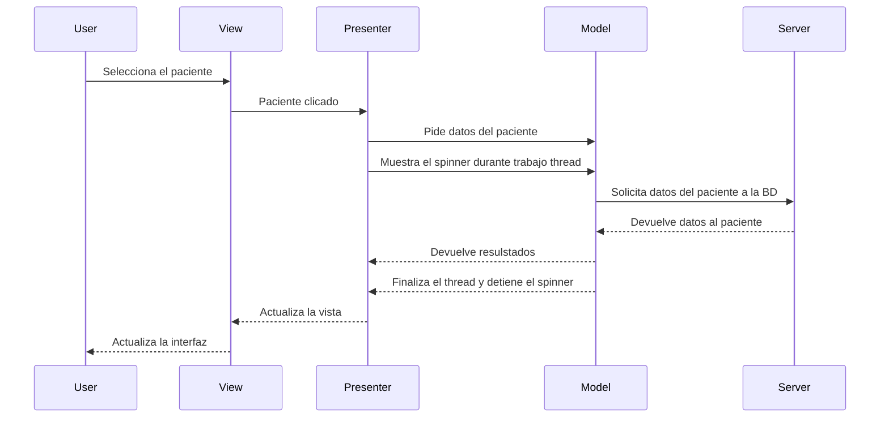
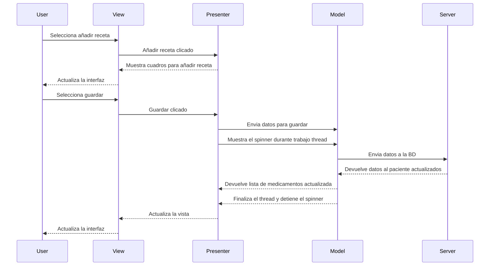
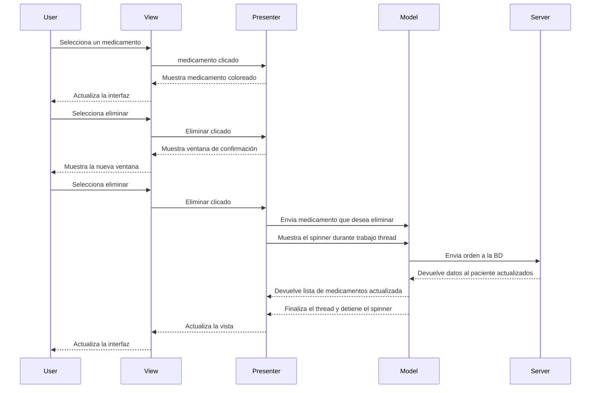
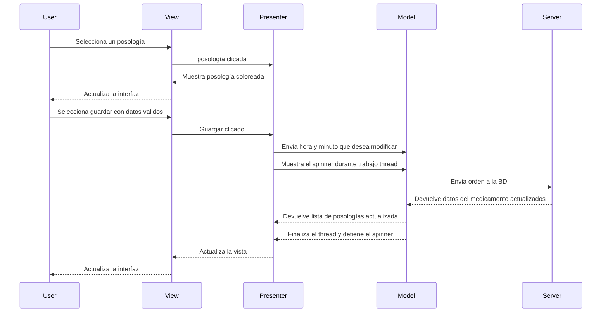

# Interfaz Dinámica

# Diagrama de Clases

```mermaid

classDiagram
    View <|-- Presenter
    Presenter <|-- View
    Model <|-- Presenter
    Presenter <|-- Model
    Patient <|-- Model
    Medication <|-- Patient
    Posologie <|-- Medication

    class View{
        -None handler
        -List[GPatient] data
        -List[GMedication] medicationList
        -int current_pageMedication
        -int current_page

        +on_activate(app: Gtk.Application)
        +set_handler( handler : PatientViewHandler)
        +build_ui( app : Gtk.Application )
        +show_about( action : Gio.SimpleAction, param : Any )
        +get_current_page()
        +set_current_page( page : int )
        +set_patients( patients : list )
        +set_medications(medications: list)
        +set_posologies(posologias: list)
        +set_patient( code : str, name : str, surname : str)
        +show_message( msg : str )
        +delete_window_confirm(patient_id: int, medication_id: int)
        +set_sensitive_next( is_sensitive : bool )
        +set_sensitive_previous( is_sensitive : bool )
        +set_sensitive_eliminar_posologiaButton(is_sensitive: bool)
        +set_sensitive_MedicationPosologieBox(is_sensitive: bool)
        +set_sensitive_AddPosologieBox(is_sensitive: bool)
        +set_sensitive_anadir_posologiaButton(is_sensitive: bool)
        +set_sensitive_save_posologiaButton(is_sensitive: bool)
        +set_sensitive_eliminar_medicationButton(is_sensitive: bool)
        +set_sensitive_anadir_medicationButton(is_sensitive: bool)
        +set_sensitive_confirmar_anadir_medicationButton(is_sensitive: bool)
        +set_sensitive_confirmar_anadir_posologiaButton(is_sensitive: bool)
        +set_sensitive_modificar_medicationButton(is_sensitive: bool)
        +set_sensitive_entry(entry: Gtk.Entry, is_sensitive: bool)
        +desmarcarFilasListaPacientes()
        +desmarcarFilasListaMedicamentos()
        +desmarcarFilasListaPosologias()
        +toggle_starred( id : int )
        +cargar_datos_medicamentos(medication: GMedication)
        +cargar_datos_posologia(posologia: GPosologie)
        +set_sensitive_MedicationInformationBox(state: bool)
        +set_sensitive_MedicationAddBox(self, state:bool)
        +get_selected_patient_id()
        +get_row_medication()
        +get_row_posologia()
        +get_selected_medication_id()
        +get_selected_posologie_id()
        +guardarCambiosMedicamento()
        +guardarCambiosPosologia()
        +medicationPosologie_getWindow()
        +addPosologie_getWindow()
        +medication_anadirWindow()
        +on_activate_addMedication()
        +on_activate_addPosologia()
        +on_activate_confirm_add_medicationButton()
        +on_activate_confirm_add_posologiaButton()
        +modificarMedicamentoListaMedicamentos(medication)
        +modificarPosologiaListaPosologias(posologia)
        +cerrar_notificacion_temporal(popover: Gtk.Widget)
        +mostrar_notificacion_temporal(padre: Gtk.Widget, message: str)
        +set_entry_error(entry: Gtk.Entry)
        +remove_entry_error(entry: Gtk.Entry)
        +noEsFechaCorrecta(start_date: str, formatoFecha: str)
        +eliminarPosologia()
        +delete_posologie_window_confirm(patient_id: int, medication_id: int, posologie_id)
    }

    class Presenter{
        -model model
        -view view

        +run(application_id: str)
        +waiting(thread: threading)
        +on_patient_selected(id: int)
        +on_patient_toggle_starred(id: int)
        +init_list()
        +on_load_page(idx: int)
        +on_medication_selected(id: int, id_patient: int)
        +on_medication_confirmAddButton(idPaciente: int, medicationName: str, dosage: float, start_date: str, treatment_duration: int)
        +on_medication_eliminarButton(idPaciente: int, idMedicamento: int)
        +guardarCambiosMedicamento(idMedication: int, medicationName: str, dosage: float, start_date: str, treatment_duration: int, idPaciente: int)
        +on_posologie_selected(idPatient: int, idPosologie: int, idMedication: int)
        +on_posologie_delete_button(patient_id: int, medication_id: int, posologie_id: int)
        +guardarCambiosPosologia(idMedication: int, idPaciente: int, idPosologia: int, hour: int, minute: int)
        +on_posologia_confirmAddButton(idPaciente: int, idMedication: int, hour: int, minute: int)
    }

    class Model{
        +get_medications(id_patient: int)
        +get_medication(id: int, id_patient: int)
        +get_posologies(id: int, id_patient: int)
        +get_patients(start_index: int, count: int)
        +get_patient(id: int)
        +add_medication (idPaciente: int)
        +eliminarMedicamentoPaciente(idPaciente: int, idMedicamento: int)
        +eliminarPosologia(patient_id: int, medication_id: int, posologie_id: int)
        +guardarCambiosMedicamento(idMedication: int, medicationName: str, dosage: float, start_date: str,treatment_duration: int, idPaciente: int)
        +guardarCambiosPosologia(idMedication: int, idPaciente: int, idPosologia: int, hour: int, minute: int)
        +add_posologie(idPaciente: int, idMedication: int, hour: int, minute: int)
    }

    class Patient{
        -int id
        -str code
        -str name
        -str surname
    }

    class Medication{
        -int id
        -str name
        -float dosage
        -str start_date
        -int treatment_duration
        -int patient_id
    }

    class Posologie{
        -int id
        -int hour
        -int minute
        -in medication_id
    }
```

# Diagramas de Secuencia

## Inicio de Aplicación

## Seleccionar Paciente

## Añadir Medicamento (con paciente seleccionado)

## Eliminar Medicamento (con paciente seleccionado)

## Modificar Posología (con medicamento seleccionado)

