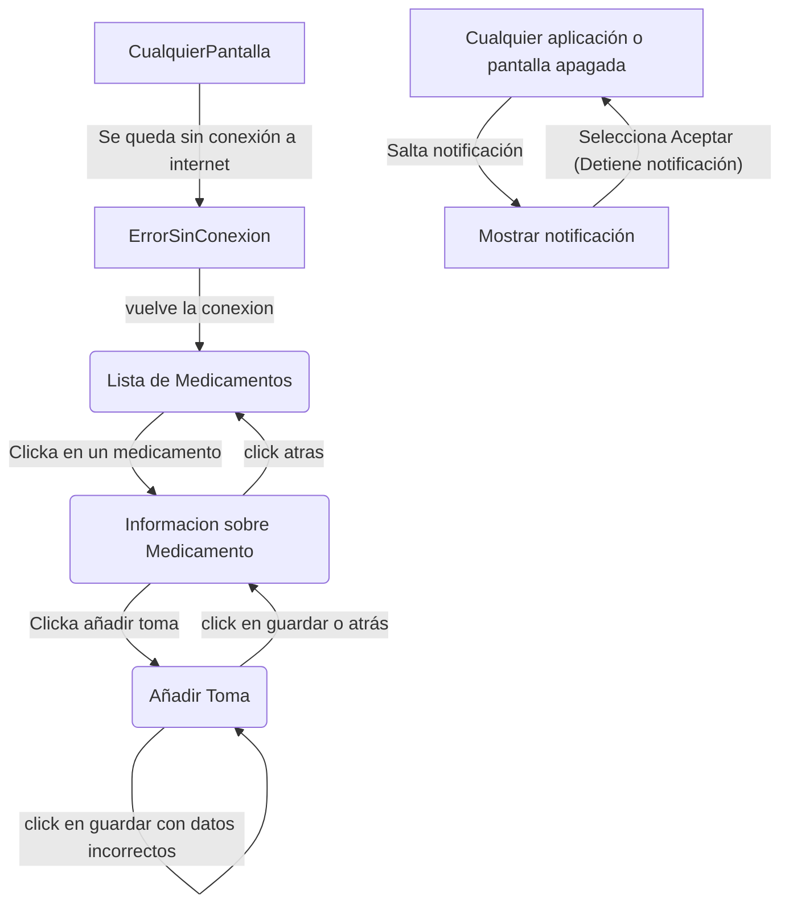
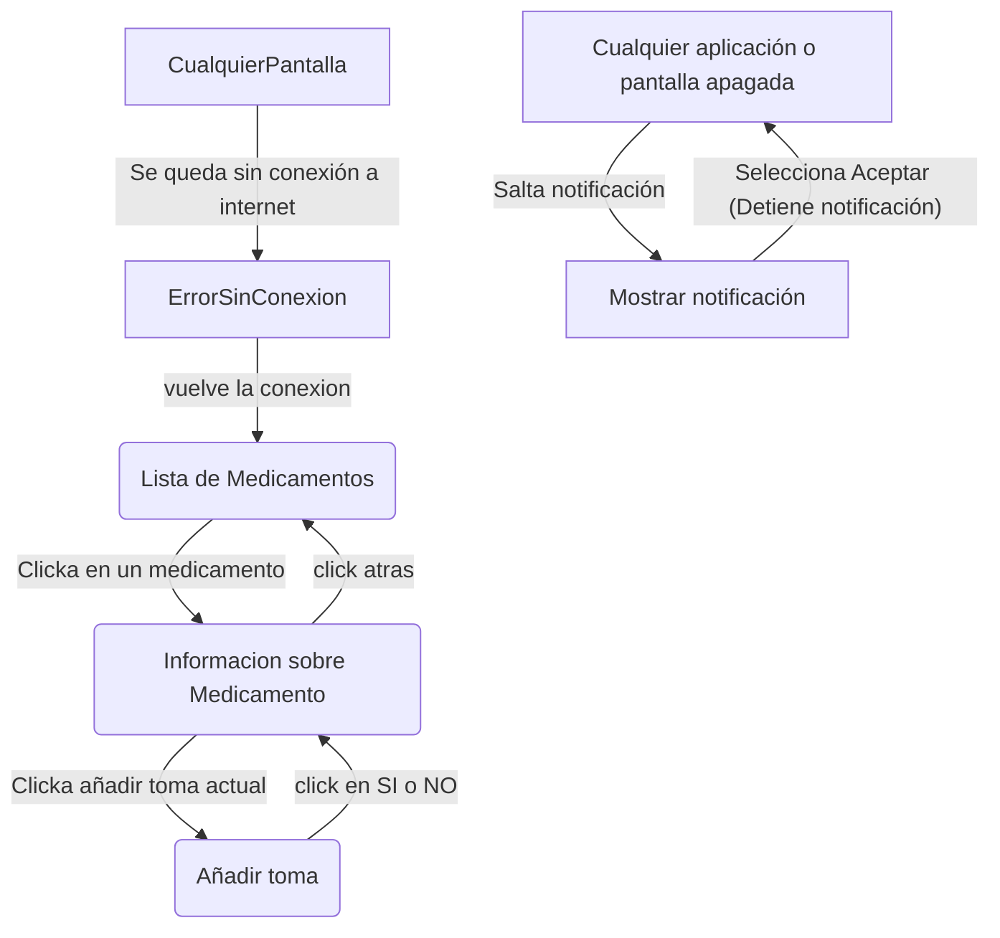
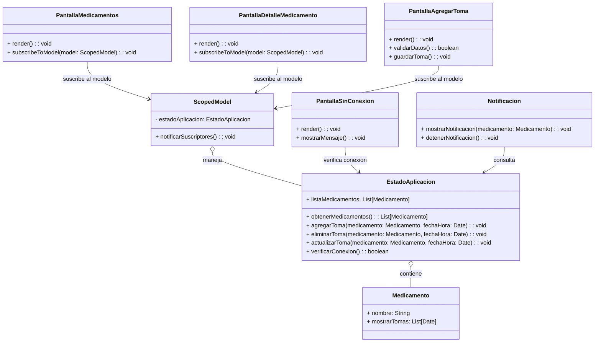
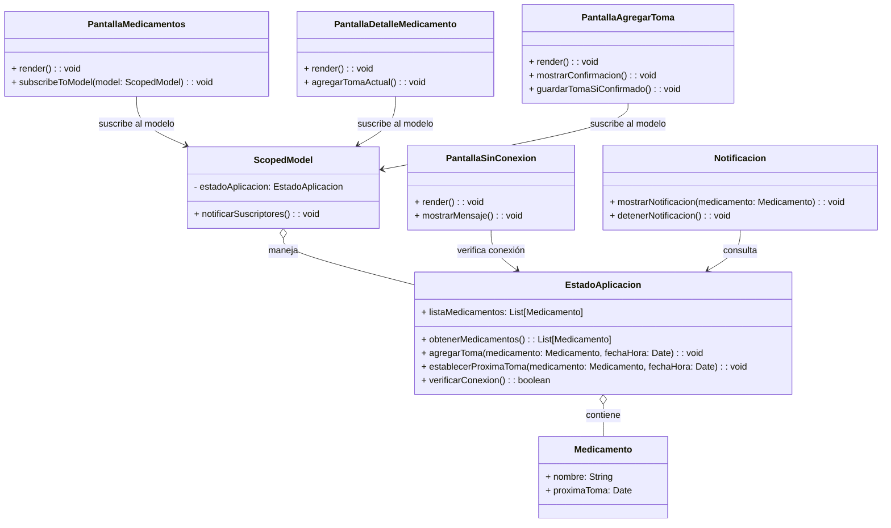
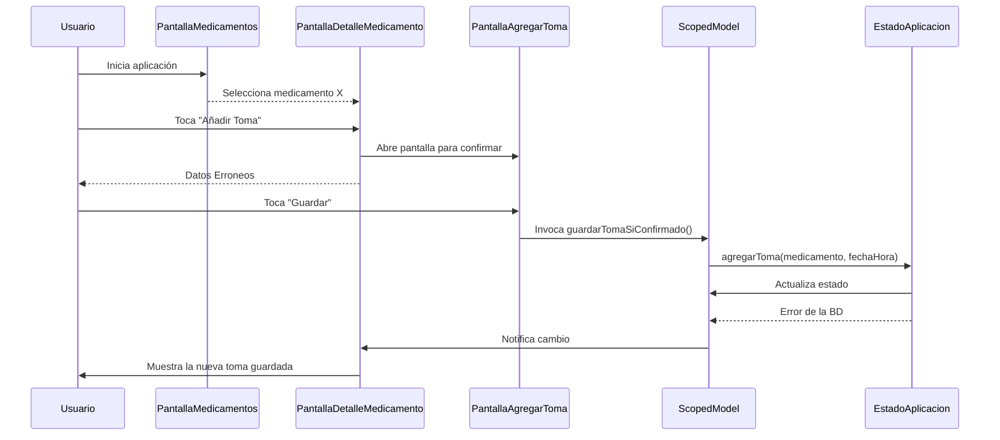
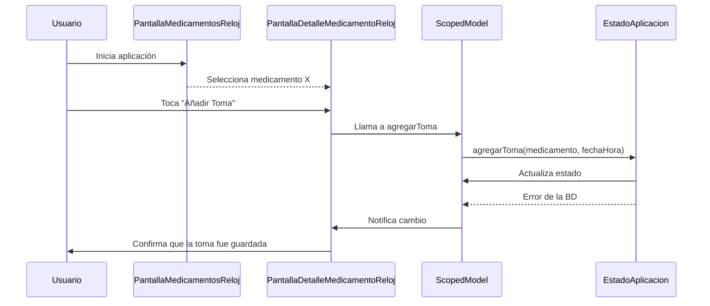
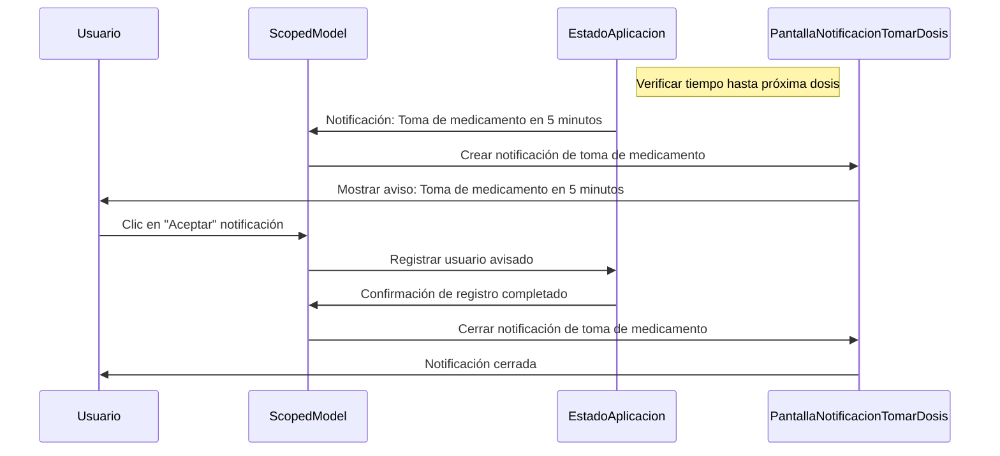

# Interfaz Dinámica

## Móvil

## Reloj

# Diagrama de Clases

## Móvil

## Reloj

# Diagramas de Secuencia

## Añadir Toma (Móvil)

## Añadir Toma (Reloj)

## Notificar Usuario próxima Toma (Reloj)

## Notificar Usuario próxima Toma (Móvil)

